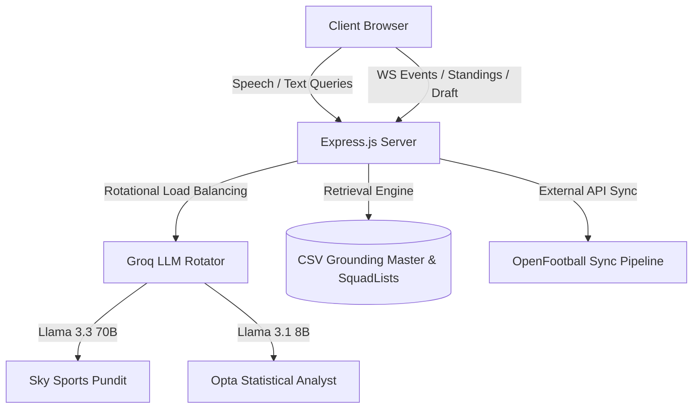

# 🏆 FIFA World Cup 2026 AI Simulator & Manager (Premium Edition)

An enterprise-grade AI simulation platform and real-time tournament manager for the upcoming FIFA World Cup 2026. This platform integrates multiple LLMs (Llama 3.3 70B & Llama 3.1 8B), interactive data visualization, real-time WebSockets synchronization, and a custom RAG (Retrieval-Augmented Generation) pipeline to deliver a premium startup-grade portfolio application.

🌐 **Live Production Link (Render):** [https://fifa-2026-17jq.onrender.com/](https://fifa-2026-17jq.onrender.com/)

---

## 🛠️ Project Architecture



### 1. Backend Layer (Express.js)
* **API Routing**: Handles team standings, squad list queries, time machine dates, draft selections, and AI chat.
* **OpenFootball Sync Engine**: Syncs live real-world matchday updates from API-Football.
* **Groq Key Rotator**: Load-balances requests across 5 API keys (`fifa1` to `fifa5`) in a round-robin rotation to bypass Groq free-tier rate limits.

### 2. AI & RAG Pipeline
* **Grounded AI RAG Engine**: Indexes **1,248 players** from `SquadLists.csv` and historical performance statistics from `FIFA2026_Grounding_Master.csv`. 
* **Prioritized Match Lookup**: Search queries (e.g. `"Vitinha"`, `"Rodri"`) are matched against shirt names and canonical names, preventing accent-related lookup failures.
* **Concurrent Multi-Model Comparison**: Queries to `/api/ai/chat` trigger concurrent calls (via `Promise.all`) to both Llama 3.3 (Tactical Pundit) and Llama 3.1 (Statistical Analyst) to compare model perspectives.

### 3. Frontend Visual System
* **Dynamic Canvas Particles**: Responsive fullscreen particle system that drifts based on cursor coordinates and adapts colors to themes (Gold, Cyber, Samba, Frost).
* **Interactive Passing Network**: An HTML5 Canvas pitch rendering lineups. Allows dragging player nodes to re-orient passing lanes and dynamically calculates passing volume.
* **Opta Striker Efficiency Plot**: Chart.js scatter plot mapping forwards' Goals vs Expected Goals (xG).

---

## ✨ Features Spotlight

1. **👤 Fan Dashboard (Tab 9)**: Save favorite team widgets, input score predictions in `localStorage`, track forecast accuracy points (+3 for exact score, +1 for correct outcome), and log real-time goal notifications.
2. **🎙️ Speech-to-Text Voice Assistant**: Click `🎤` inside the AI Chat tab to speak queries natively using the browser Web Speech API.
3. **🏆 10k Monte Carlo Tournament Simulator**: Simulate the remaining tournament matchups 10,000 times in the client to generate real-time trophy win probabilities for all 48 teams.

---

## 🚀 Installation & Local Setup

### Prerequisites
* Node.js (v18+)
* Groq API Keys (at least one key is required; up to five for rotation)

### Setup Instructions
1. **Clone & Install**:
   ```bash
   git clone https://github.com/lakshcity16/FIFA-2026.git
   cd FIFA-2026
   npm install
   ```

2. **Configure Environment**:
   Duplicate `.env.example` as `.env` and fill in your keys:
   ```bash
   cp .env.example .env
   ```
   Add your keys inside `.env`:
   ```env
   fifa1=gsk_your_key_1_here
   fifa2=gsk_your_key_2_here
   # Add up to fifa5 for rotational load balancing
   PORT=3050
   ```

3. **Start Server**:
   ```bash
   npm start
   ```
   Access the dashboard locally at `http://localhost:3050`.

---

## 🔮 Future Enhancement Roadmap (Home Laptop Checklist)

Here is a devised roadmap to implement on your home laptop to upgrade this project to enterprise production standards:

### 1. AI Scouting Module (`[ ]` Pending)
* **Goal**: Add a search bar inside the Squad tab to scout player details.
* **AI Logic**: Query Llama to return scouting reports including Strengths, Weaknesses, Transfer Value, Potential, and similar player profiles.

### 2. AI Tactical Analyst (`[ ]` Pending)
* **Goal**: Let users select a formation layout (e.g., 3-5-2 vs 4-3-3).
* **AI Logic**: Generate structured tactical reports outlining defensive risk areas (e.g. "Weak Left Flank", "High Counter-Attack Vulnerability").

### 3. Live Win-Probability Graphs (`[ ]` Pending)
* **Goal**: Draw an updating line chart during live match simulations showing minute-by-minute win probabilities (Home Win / Draw / Away Win) reacting to goals and red cards.

### 4. AI Voice Commentary (`[ ]` Pending)
* **Goal**: Integrate Web Speech Synthesis (Text-to-Speech) so the AI narrates match goals and crucial timeline events aloud.

### 5. Enterprise Infrastructure Upgrades (`[ ]` Pending)
* **Docker Containerization**: Add a `Dockerfile` and `docker-compose.yml` to run the Express backend and client assets inside isolated containers.
* **Automated Testing Suite**: Write unit tests for the CSV parsers and RAG retrieval methods utilizing Jest.
* **Caching Layer**: Integrate Redis to cache LLM responses for similar match queries, boosting performance.
